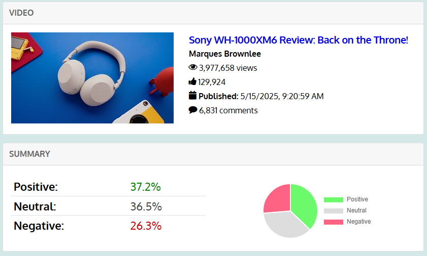
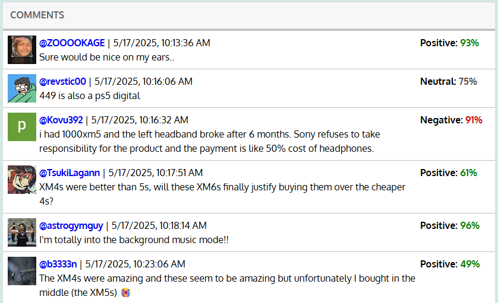

# TubeMood

Conduct sentiment analysis of comments on any YouTube video.

This project fetches up to 1,000 comments and applies transformer-based sentiment analysis using PyTorch to classify each comment as positive, negative, or neutral. Comments are also analyzed in bulk to show charts of summarized sentiment data across all the comments on each video.

## Screenshots

## Acknowledgements

Sentiment analysis is conducted using the [twitter-roberta-base-sentiment-latest](https://huggingface.co/cardiffnlp/twitter-roberta-base-sentiment-latest) model by Cardiff NLP.

This project includes code from my app [YouTube Comment Viewer](https://github.com/sameerdash2/comment-viewer), which is licensed under the MIT license (https://opensource.org/license/mit/).
